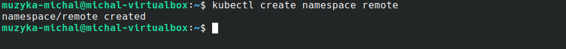
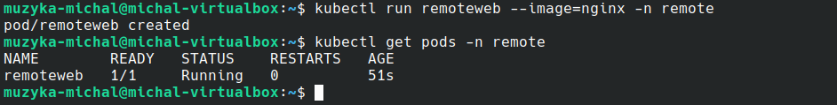
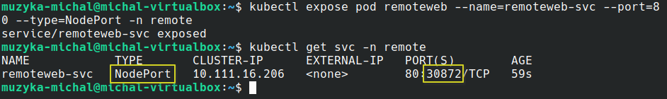
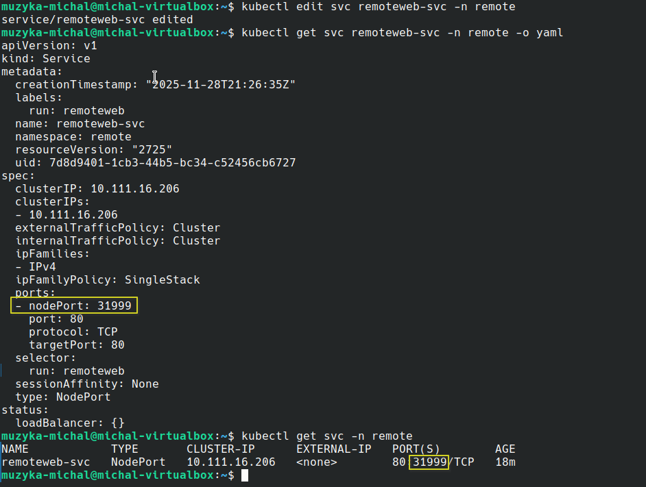
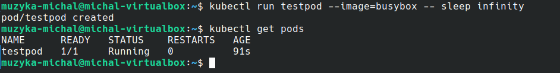
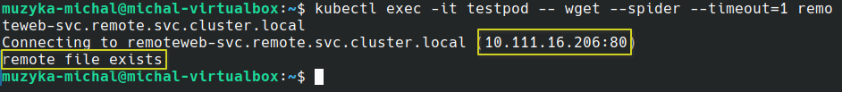
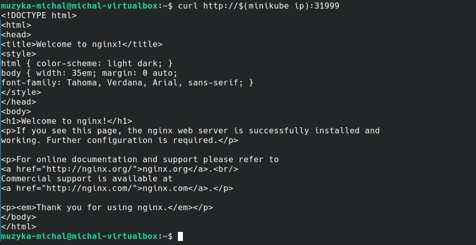

# Michał Muzyka 2.3 – Sprawozdanie Lab 7

### Tworzę namespace 'remote'.

### Uruchamiam poda o nazwie 'remoteweb' na bazie obrazu nginx w przestrzeni nazw 'remote'. Weryfikuję, czy pod działa. Pod działa.

### Udostępniam pod na zewnątrz na węzeł klastra poprzez utworzenie obiektu Service typu NodePort o nazwie 'remoteweb-svc' w przestrzeni nazw 'remote'. Ustawiam port usługi wewnątrz klastra na port 80. Weryfikuję usługę. Został jej przydzielony port zewnętrzny 30872. 

### Polecenie expose przydzieliło losowy port. Edytuję więc konfigurację obiektu usługi. Zmieniam port na 31999. Weryfikuję zmianę. Port został zmieniony.

### W domyślnej przestrzeni nazw uruchamiam poda 'testpod' na bazie obrazu busybox, używającego polecenia 'sleep infinity' jako domyślnego polecenia. Weryfikuję, czy pod działa. Pod działa.

### Łączę się z podem 'testpod' i sprawdzam, czy mogę połączyć się z usługą 'remoteweb-svc' w namespace 'remote'. Używam polecenia 'wget --spider' z krótkim timeoutem 1 sekundy, żeby tylko sprawdzić dostępność, nie pobierać pliku. Kubernetes odpowiada, że pod 'remoteweb' jest dostępny pod adresem 10.111.16.206:80 i że plik istnieje, co potwierdza, że komunikacja tych podów między namespace'ami działa.

### Weryfikuję, czy strona internetowa z poda 'remoteweb' jest dostępna na porcie węzła minikube 31999. Strona jest dostępna.

